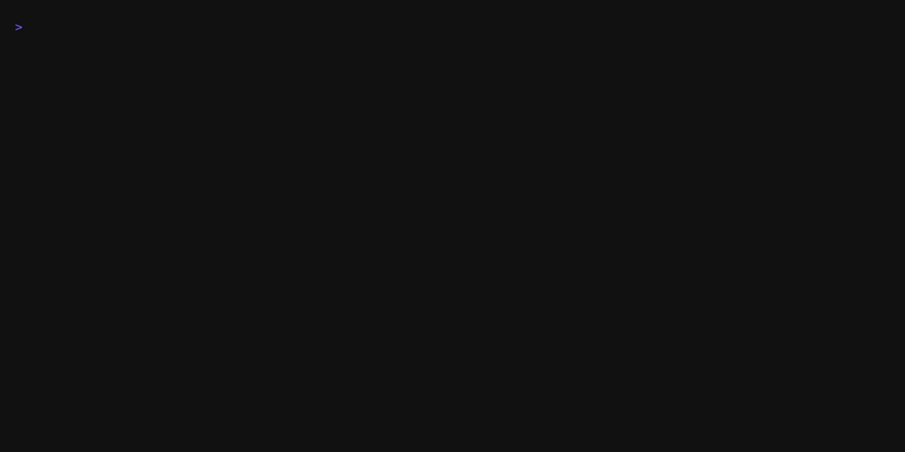

# Mozzy Demos & Recordings 🎬

This document explains how to create and update the demo GIFs for the README.

## Generated GIFs

All demo GIFs are in the `assets/` directory:

1. **demo-showcase.gif** - Main showcase with multiple features
2. **demo-01-github-api.gif** - GitHub API exploration
3. **demo-02-collections.gif** - Request collections
4. **demo-03-jq-filtering.gif** - JQ filtering examples
5. **demo-04-verbose.gif** - Verbose mode with timing
6. **demo-05-post.gif** - POST requests with JSON

## Recording with VHS

### Prerequisites

```bash
brew install vhs ffmpeg ttyd
```

### Generate All Demos

```bash
cd demo-scripts/vhs
./generate-all.sh
```

This will create all GIFs in the `assets/` directory.

### Generate Individual Demo

```bash
cd demo-scripts/vhs
vhs 01-github-api.tape
```

## VHS Tape Files

Located in `demo-scripts/vhs/`:

- `00-showcase.tape` - Main showcase (appears at top of README)
- `01-github-api.tape` - GitHub API examples
- `02-collections.tape` - Collections management
- `03-jq-filtering.tape` - JQ filtering
- `04-verbose-mode.tape` - Verbose output
- `05-post-request.tape` - POST with JSON

## Customizing Demos

Edit the `.tape` files to change:

```tape
Set FontSize 18              # Larger font for readability
Set Width 1400               # Terminal width
Set Height 900               # Terminal height
Set Padding 30               # Padding around terminal
Set Theme "Dracula"          # Color theme
Set TypingSpeed 100ms        # Speed of typing animation
```

## Available Themes

- `Dracula` (default for showcase)
- `Molokai` (default for examples)
- `Nord`
- `One Dark`
- `Solarized Dark`
- `Solarized Light`
- `Catppuccin`

## Tips for Better Recordings

1. **Keep it short** - 15-30 seconds per demo
2. **Show real APIs** - Use public APIs like GitHub, JSONPlaceholder
3. **Add comments** - Use echo to show what you're demoing
4. **Use colors** - Always add `--color` flag
5. **Wait for responses** - Add adequate Sleep times
6. **Clear between steps** - Use Hide/Type clear/Show for clean transitions

## Optimizing GIF Size

If GIFs are too large:

```bash
brew install gifsicle

# Optimize a single GIF
gifsicle -O3 --lossy=80 input.gif -o output.gif

# Batch optimize all GIFs
for f in assets/demo-*.gif; do
  gifsicle -O3 --lossy=80 "$f" -o "${f%.gif}-optimized.gif"
  mv "${f%.gif}-optimized.gif" "$f"
done
```

## Re-recording After Changes

When you update mozzy features:

1. Update the relevant `.tape` file in `demo-scripts/vhs/`
2. Regenerate that specific demo:
   ```bash
   cd demo-scripts/vhs
   vhs 01-github-api.tape
   ```
3. Check the output in `assets/`
4. Commit the updated GIF

## README Integration

GIFs are referenced in README.md like this:

```markdown
<p align="center">
  
</p>
```

For individual examples:

```markdown
<p align="center">
  
</p>
```

## Troubleshooting

### GIF not generating
- Check VHS is installed: `which vhs`
- Check ffmpeg: `which ffmpeg`
- Check ttyd: `which ttyd`
- Run tape manually to see errors: `vhs 01-github-api.tape`

### Colors not showing
- Use `--color` flag in mozzy commands
- Check theme name spelling in tape file
- Try different theme: `Set Theme "Dracula"`

### Terminal too small/large
- Adjust Width and Height in tape file
- Common sizes:
  - Showcase: 1400x900
  - Examples: 1200x600-800

### Recording too slow
- Reduce Sleep durations
- Increase TypingSpeed: `Set TypingSpeed 50ms`

### mozzy command not found
- Ensure mozzy is installed: `mozzy version`
- Check PATH: `which mozzy`
- Add to PATH if needed: `export PATH="/usr/local/bin:$PATH"`

## Alternative: Manual Recording

If VHS doesn't work, use macOS screen recording:

1. Press `Cmd + Shift + 5`
2. Select "Record Selected Portion"
3. Run demo script: `./demo-scripts/01-github-api.sh`
4. Stop with `Cmd + Ctrl + Esc`
5. Convert to GIF:
   ```bash
   ffmpeg -i recording.mov -vf "fps=10,scale=800:-1" output.gif
   ```

## Hosting Considerations

Current setup: GIFs in `assets/` directory (committed to repo)

**Pros:**
- No external dependencies
- Always available
- Works in offline docs

**Cons:**
- Increases repo size
- Slower git operations

**Alternative:** Upload to GitHub Releases or CDN, update README links.

## Version Control

- ✅ Commit `.tape` files (they're small text files)
- ⚠️ GIFs are binary - consider if they should be in git
- 💡 Could use Git LFS for large media files
- 💡 Could upload to Releases and link from README

## Future Improvements

- [ ] Add more demos (JWT, workflows, testing)
- [ ] Create shorter "quick feature" GIFs
- [ ] Add CLI recording of actual terminal (not VHS)
- [ ] Create video tutorials
- [ ] Add subtitles/captions to GIFs
- [ ] Create dark/light theme variants
